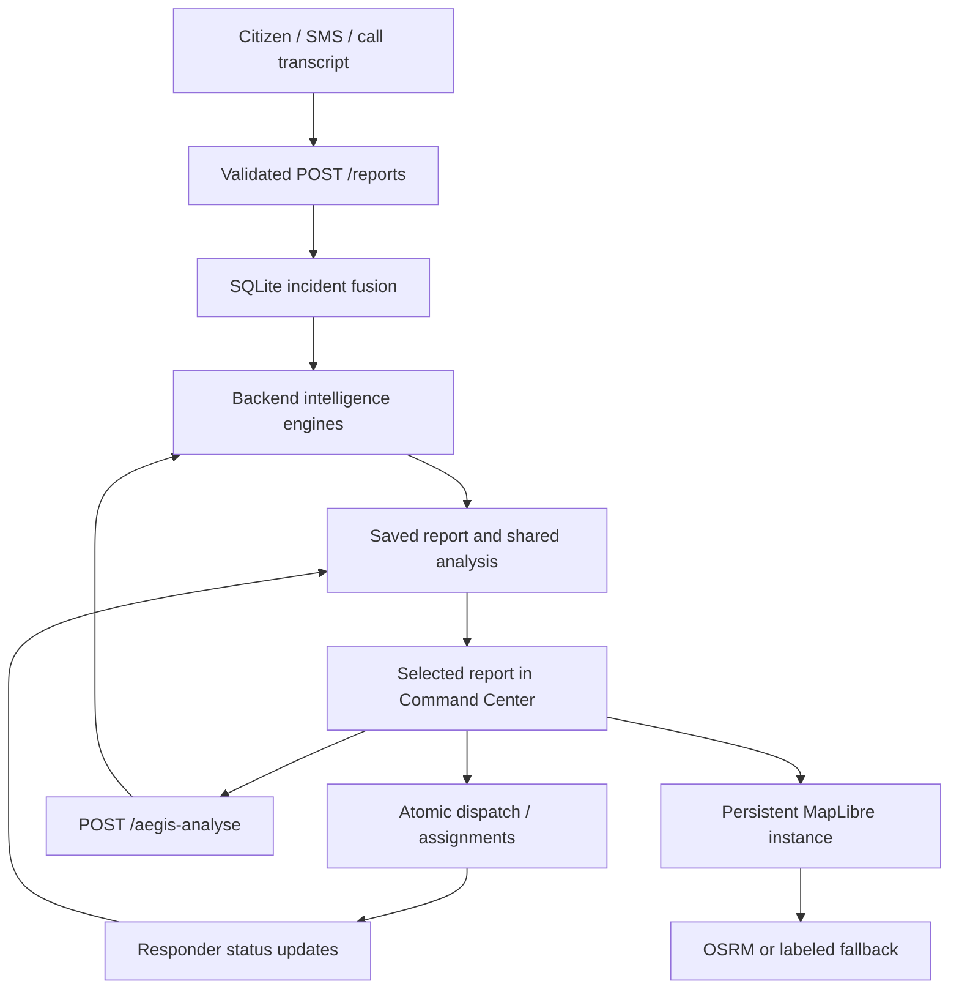

# AEGIS architecture

## Runtime and ownership

Analysis completes synchronously before the report receipt. Command briefly replays stored stage names and measured durations while revealing results. This animation is labeled as presentation of completed backend work; it is not streamed computation.

## Important files

| File or folder | Responsibility |
| --- | --- |
| `frontend/src/App.tsx` | Router and citizen, receipt, command and responder screens |
| `frontend/src/api.ts` | TypeScript contracts and timed API requests |
| `frontend/src/usePolling.ts` | One in-flight read per hook, retained successful state, cleanup |
| `frontend/src/OperationalMap.tsx` | Map lifecycle, layers, markers and arrival synchronization |
| `frontend/src/routing.ts` | OSRM adapter, explicit fallback, route assessment and interpolation |
| `frontend/src/useRoadScenario.ts` | Incident road scenario shared within the same browser |
| `frontend/src/BackendIntelligence.tsx` | Backend severity, evidence, forecast and staging explanations |
| `frontend/src/UnifiedCommandModules.tsx` | Field operations, coordination, prediction, readiness and audit |
| `frontend/src/ScenarioStressTest.tsx` | Backend shelter-closure and road-delay comparisons |
| `frontend/src/IntakeChannels.tsx` | SMS/transcript normalization and optional browser speech capture |
| `frontend/src/ErrorBoundary.tsx` | Recoverable rendering failure screen |
| `backend/main.py` | FastAPI routes, lifecycle, CORS and errors |
| `backend/models.py` | Validated report and scenario schemas |
| `backend/operations.py` | Fusion aggregation, analysis refresh, atomic dispatch and transitions |
| `backend/db.py` | SQLite schema, migration, repository, fusion matching and audit |
| `backend/engines/` | Severity, confidence, resources, hospital, risk, prediction, capacity, relocation |
| `data/*.json` | Local infrastructure catalogues with stable IDs |
| `data/aegis.db` | Default user database; verification uses separate files |
| `scripts/`, `backend/tests/` | Launch helpers, browser checks and domain/API tests |

The original backup directory is retained. Six unreferenced intelligence implementations were removed after consolidation into active modules. App and the database repository still have legacy sections that can be extracted in future maintenance.

## Shared incident state

Reports preserve submitted observations. Same-type reports within 90 minutes can fuse when within 3 km, or within 5 km with sufficient location-name similarity. This heuristic can over-merge nearby emergencies; no manual split interface exists.

A fused estimate takes the maximum affected, injured, trapped and hazard values, unions vulnerable groups and retains positive spreading/structural flags. Duplicate populations are never summed. Every group member receives the same analysis; assignments belong to the first, canonical report.

Citizen affected people and modeled habitation exposure are different, explicitly labeled populations. A citizen report of 18 can coexist with a relocation plan for 1,422 catalogue residents without claiming 1,422 reported victims.

## Persistent operations

SQLite `BEGIN IMMEDIATE` transactions protect availability checks and assignment writes. Dispatch recalculates availability; repeating dispatch for the same fused incident returns existing assignments.

Report stages: REPORTED, ACKNOWLEDGED, DISPATCHED, EN_ROUTE, ON_SCENE, RESOLVED. Assignment stages: ASSIGNED, ACCEPTED, EN_ROUTE, ON_SCENE, RESOLVED, ISSUE. Invalid transitions return 409. First departure saves `departed_at`; repeated requests do not restart movement. A late departure cannot regress an incident after another unit arrives. All active assignments must resolve for incident completion.

The UI requires acknowledgment before dispatch; the compatible API also accepts a received report directly. Reassignment links old and replacement assignments in audit history.

Schema upgrades add missing columns. Startup refreshes legacy analysis envelopes missing the new pipeline once, preserving prior calculations in ANALYSIS_UPGRADED audit metadata. Original report observations and assignment rows remain intact.

## Map lifecycle

A mounted map owns one MapLibre instance. Resource-ID-keyed markers move in place. requestAnimationFrame interpolates precomputed cumulative route lengths with binary search; it does not rebuild the map, refetch roads or scan full geometry per frame. ETA text updates more slowly.

Routes change only when origins or incident coordinates change, use a five-minute cache, and time out after six seconds. The locally bundled worker and style allow overlays when external raster tiles fail. Effects remove listeners, markers and timers. Browser verification checks marker and canvas identity during movement.

Demo travel lasts 18-55 seconds and uses persisted departure time, so refresh does not restart it. An open map posts ON_SCENE at completion. The backend does not independently move vehicles while every client is closed.

## APIs

| Endpoint | Purpose |
| --- | --- |
| `GET /health` | Actual database connectivity |
| `POST /reports` | Validate, save, fuse, analyse |
| `GET /reports`, `GET /reports/{id}` | Saved reports and analysis |
| `PATCH /reports/{id}/status` | Acknowledgment |
| `POST /reports/{id}/dispatch` | Atomic, idempotent dispatch |
| `GET /assignments` | Shared unit state |
| `PATCH /assignments/{id}/status` | Responder progress |
| `POST /assignments/{id}/reassign` | Replacement and audit |
| `GET /fusion/{id}/reports`, `GET /audit-events` | Related reports and history |
| `GET /resources` | Catalogue plus availability |
| `POST /aegis-analyse` | Integrated, non-persisting calculation and What-If |
| `POST /incident` | Preserved analysis compatibility endpoint |
| `POST /hazard-analysis` | Habitation risk |
| `GET /relocation-centres`, `POST /relocation-plan` | Capacity and allocation |
| `POST /demo/reset` | Disabled by default; prefer a fresh database |

FastAPI `/docs` provides full schemas. What-If sends the selected fused observation and overrides to `/aegis-analyse`. Optional `report_id` excludes that incident's own units from other-incident occupancy and supplies its evidence. What-If never writes reports, assignments or shelter occupancy.

## Routes and deployment

`/report`, `/track/:reportId`, `/command?report=...`, `/responder?unit=...`, `/sms` and `/call` remain available. Legacy `/simulate` and `/relocation` open Command; select a saved incident and the relevant tab. A missing report shows an error instead of selecting an unrelated recent report.

Vite proxies `/api` locally. Deployment requires a reverse proxy or build-time API base and explicit CORS. OSRM and catalogue loaders are adapter boundaries for future real infrastructure integrations. See [README.md](README.md) for exact configuration.
